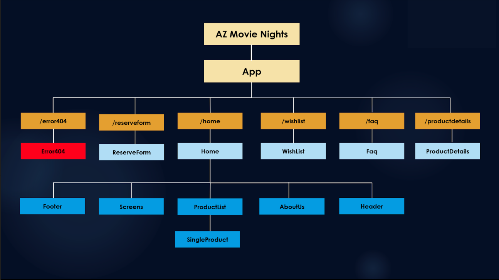

# **Movie Night App**
#### By Trevor Mackin   

##### GH_PAGES: https://ratta2ii.github.io/movie_night_app/

## **Component Tree Planning Phase**

## **Description**

_This is a client-side application built with React. The project focuses on building a website for an outdoor movie theatre rental company. I used Redux for state management, a Formspree API for email services, and Material-Ui for all of the design. The application is 100% responsive and built for both Mobile and Desktop._

_The business has a small number of products that a user can choose from by clicking on an item. Once the user chooses a product, a single page will be populated with all the corresponding data from that particular product. From here, a user will be able to add this product to the cart, view the entirety of their cart at this point, move on to the checkout page, or return back to the list of products._

_When a user has decided that they have saved all relevant products in the cart, a user will then head to checkout where they will see their total costs -with taxes- and be asked to fill out a form. The form will include personal information, the day and time of the event, and any message the user may want to write. There is also a hidden form field that attaches the entirety of the cart to the input value. This information will then be used to populate an email response to the business owner by calling an API with the form input values. The email is to be sent to the owner, along with all the all the cart items from the hidden input._ 

_The reason for the unorthodox checkout is due to the nature of the company. It is my understanding that the company prefers to first speak with customers before accepting any payment, due to the many factors that go into planning an event._ 

## IMPORTANT NOTES:

1. The site currently uses lots of mock data. I have created it in a way that the admin can upload their files within a specific structure, and it will populate the entire application. That said, there is currently some placeholder text being used, so fear not if it looks like I duplicated anything. :-)
2. Don't forget to get on your phone and check out the mobile version as well. This site was styled for 5 different viewport sizes, including mobile.

##  **Setup/Installation Instructions**

1. Github Project Address: https://github.com/ratta2ii/movie_night_app
2. $ git clone https://github.com/ratta2ii/movie_night_app.git (Clone repository)
3. $ cd movie_night_app (Navigate to the project directory) 
4. $ npm install
5. $ npm run start

## **Technologies Used**

* React
* JavaScript
* Redux
* HTML
* CSS
* Material UI
* Form Spree (Email Services)
* Webpack
* npx-create-react-app

## **License**

MIT License
Copyright (c) 2020 **MIT** (Trevor Mackin)

